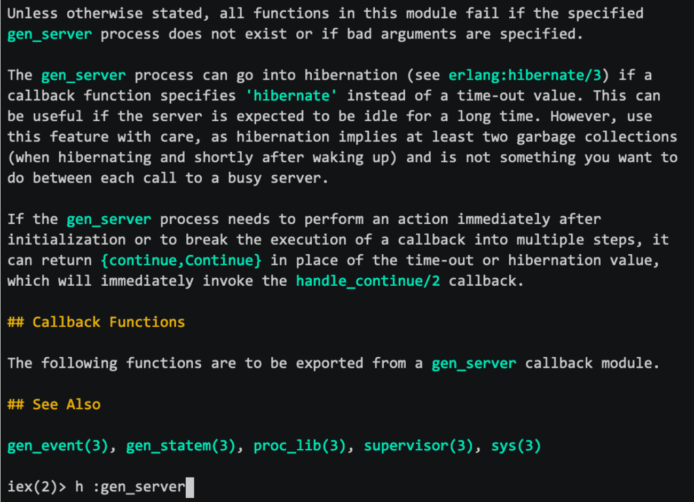

@title[Elixir - Dashbit]

@snap[north span-100]
### News from
@snapend


@snap[south span-100]
@josevalim / @elixirlang / @dashbit
@snapend

---?color=#4E4A8B

@snap[midpoint span-100]
# Elixir v1.10
@snapend

---

@snap[north span-100]
### Elixir v1.10
@snapend

- Jan / 2020
- &gt; 900 Contributors
- &gt; 10 650 packages on hex.pm
- &gt; 1 300 000 000 downloads

---

@snap[north span-100]
### Elixir v1.10
@snapend

- Erlang/OTP 21+ requirement
- Improvements around releases
- Compilation tracers
- Compile-time configuration
- ExUnit pattern diffing

---

@snap[north span-100]
### Erlang/OTP 21+ requirement
@snapend

@ul
- Integration with Erlang's new logger
    - As of v1.10, all log levels, metadata, and messages are shared between Elixir and Erlang
    - Thanks to @hauleth!
- Added is_map_key/2 and is_struct/1 as guards
@ulend

----

@snap[north span-100]
### Improvements to releases
@snapend

@ul
- Allow opt-out from dual boot system
- Support for release overlays
- Accept RELEASE_DISTRIBUTION=none
- Add :tar to support release steps
@ulend

---

@snap[north span-100]
### Compilation tracers
@snapend

```elixir zoom-20
defmodule MyMod do
  if OtherMod.some_condition? do
    def some_fun do
      ...
    end
  end
end
```

@[2,6]

---

@snap[north span-100]
### Compilation tracers
@snapend

```elixir zoom-26
defmodule MyTracer do
  def trace(event, compile_env)
end
```

---

@snap[north span-100]
### Compilation tracers
@snapend

- Boundary - github.com/sasajuric/boundary
- import2aliases - github.com/hexpm/hexpm/pull/887
- Tutorial - blog.appsignal.com/2020/03/10/building-compile-time-tools-with-elixir-compiler-tracing-
- See “Code" module docs


---

@snap[north span-100]
### Compilation environment
@snapend

```elixir zoom-14
defmodule MyApp.DBClient do
  @db_host Application.get_env(:my_app, :db_host, "db.local")

  def start_link() do
    SomeLib.DBClient.start_link(host: @db_host)
  end
end
```

---

@snap[north span-100]
### Compilation environment
@snapend

```elixir zoom-14
defmodule MyApp.DBClient do
  def start_link() do
    SomeLib.DBClient.start_link(host: db_host())
  end

  defp db_host() do
    Application.get_env(:my_app, :db_host, "db.local")
  end
end
```

---

@snap[north span-100]
### Compilation environment
@snapend

```elixir zoom-16
defmodule MyApp.DBClient do
  def start_link(opts \\ []) do
    host = Keyword.put_new(opts, :host, "db.local")
    SomeLib.DBClient.start_link(host: host)
  end
end
```

---

@snap[north span-100]
### Compilation environment
@snapend

```elixir zoom-13
defmodule MyApp.DBClient do
  @db_host Application.compile_env(:my_app, :db_host, "db.local")

  def start_link() do
    SomeLib.DBClient.start_link(host: @db_host)
  end
end
```

---

@snap[north span-100]
### Compilation environment: stay ahead!
@snapend

 1. Don’t use the application environment
 1. If you have to use it, use it at runtime
 1. If you have to use it at compile-time, use compile_env

---

@snap[north span-100]
### Compilation environment
@snapend

```elixir zoom-19
test "gist" do
  assert %{
          "truncated" => "false",
          "owner" => %{"login" => "octocat"}
         } = github_gist()
end
```

---?image=assets/img/test-gist-1.png&color=black&size=95% auto
@title[Test Gist 1]


---?image=assets/img/test-gist-2.png&color=black&size=95% auto
@title[Test Gist 2]

---

@snap[north span-100]
### ExUnit Pattern Diffing
@snapend

- Thanks to @lexmag for ExUnit value diffing
- Thanks to @ggcampinho and @jeremyowensboggs for ExUnit pattern diffing

---?color=#4E4A8B

@snap[midpoint span-100]
# Elixir v1.11
@snapend

---

@snap[north span-100]
### Elixir v1.11
@snapend

@ul
- Calendar.strftime/3 for datetime formatting
- map.field and is_struct/2 are allowed in guards
- Add notice, critical, alert and emergency log levels
- Support structured logging
- Warn if using modules from non-dependencies
@ulend

---

@snap[north span-100]
### Elixir v1.11: Erlang docs in IEx
@snapend

@snap[west span-52]

@snapend

@snap[east span-48 text-center text-07]
- Thanks to the Erlang/OTP team
- Thanks to the Erlang Ecosystem Foundation - Documentation WG
@snapend

---
@title[Dashbit]


---?color=#4C74BA

@snap[midpoint span-100]
# Broadway v0.6
@snapend

---

@snap[north span-100]
### Broadway v0.6
@snapend

@ul
- Date-ingestions and data-pipelines in Elixir made easy
- Supports: **Kafka**, AmazonSQS, RabbitMQ and Google CPS
- **v0.6**: supports rate-limiting (thank you @whatyouhide)
- **v0.6**: built-in telemetry events
@ulend

---?color=#69B739

@snap[midpoint span-100 h1-white]
# Ecto v3.4
@snapend

---

@snap[north span-100]
### Ecto v3.4
@snapend

@ul
- Built-in support to MSSQL via TDS<br>Thanks to the massive effort from @mjaric
- Query language now supports JSON/embed expressions:
- from u in User, where: u.settings["panel_enabled"]
- from u in User, where: u.settings.panel_enabled
@ulend

---?color=#EB4026

@snap[midpoint span-100]
# Phoenix-related
@snapend

---

@snap[north span-100]
### Phoenix Related
@snapend

@ul[text-09]
- A new authentication solution for Phoenix:<br>dashbit.co/blog/a-new-authentication-solution-for-phoenix
- We have another open source project to announce really soon.<br>Stay posted!
@ulend

---

@snap[north span-100]
<p>
# Thank you!
@snapend

@snap[south span-100]

@josevalim / @elixirlang / @dashbit
@snapend

